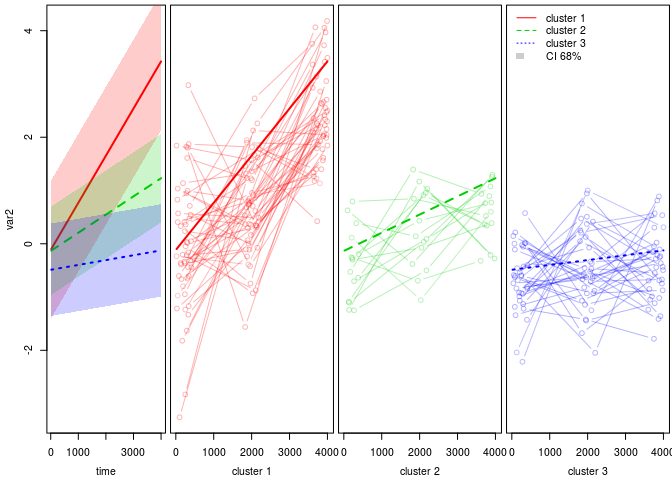
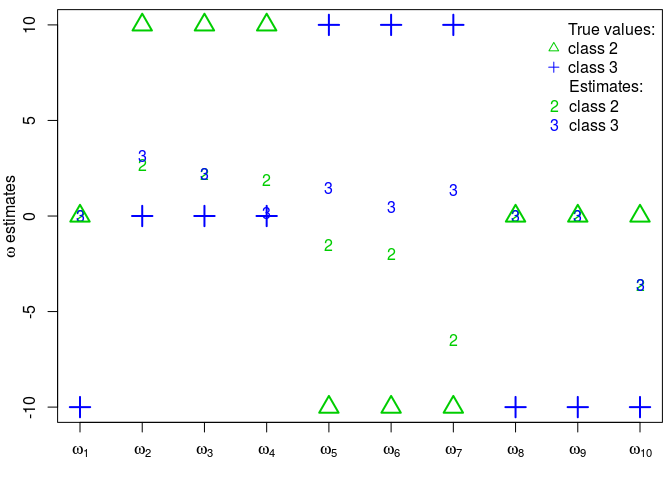

Description
===========

The `DiSuGen` R tool is designed to subtype diseases from both (longitudinal or functional) clinical follow-up data and (large size) genotyping data. `DiSuGen` performs a clustering of individuals (the patients) from both functional or longitudinal (clinical) variables and a large number of (genotyping) covariables via a mixture of regressions model, with logistic weights function of the covariables. The (genetic) covariables that may not be relevant for clustering are discarded by maximizing a penalized likelihood via a (Classification) Expectation Maximization (CEM) algorithm.

At the heart of this tool is the `FlexMix` R package \[1\], to which has been added a driver that selects the covariates using the `glmnet` R package \[2\], as well as a coating that allows the use of functional or longitudinal data, a suitable model selection and a correction of the bias resulting from the penalty in the logistic regression.


More information about `DiSuGen` can be found in the following working paper:

Marie Courbariaux, Christophe Ambroise, Cyril Dalmasso, Marie Szafranski, Memodeep Consortium. *A mixture model with logistic weights for disease subtyping with integrated genome association study*. 2018. 〈[hal-01822237](https://hal.archives-ouvertes.fr/hal-01822237)〉

Example of use on a simulated data set
======================================

Simulated data set and required data format
-------------------------------------------

For illustration purpose, we use the following simulated data set:

``` r
load("dataset.RData", verbose = TRUE)
```

    ## Loading objects:
    ##   datmix
    ##   clin
    ##   xnam

`datmix` is the data in the required format:

``` r
head(datmix[,1:10])
```

    ##   PATIENT visit time         var1       var2 Intercept SNP1 SNP2 SNP3 SNP4
    ## 1    pat1     1  100 -1.033261792 -3.2566958         1    1    1    1    1
    ## 2    pat1     2 1880  1.630047330  1.2306594         1    1    1    1    1
    ## 3    pat1     3 3950 -0.008757521  3.9673879         1    1    1    1    1
    ## 4    pat2     1  130 -1.572653106 -1.0868710         1    0    0    1    0
    ## 5    pat2     2 2200 -0.074795299  1.0295187         1    0    0    1    0
    ## 6    pat2     3 3980 -0.478657391 -0.2774568         1    0    0    1    0

where:

-   `PATIENT` are the patient ids,
-   `visit` are the visit numbers,
-   `time` are the visit times,
-   `var1, var2, var3,...` are the (clinical) clustering variables, listed in `clin`,
-   `Intercept, SNP1, SNP2,...` are the intercept and concomitant (genetic) (here, binary) variables, listed in `xnam`.

Required functions
------------------

The required libraries are the following:

``` r
library(flexmix)
library(nnet)
library(glmnet)
```

And the clustering functions of `DiSuGen` are the following:

``` r
source("F_FLXPmultiLasso.R")
source("F_assoclog.R")
source("F_DiSuGen.R")
```

Calling the main function of DiSuGen
------------------------------------

``` r
RESclust1 <- DiSuGen(
  datmix=datmix,
  fams=NA,
  long=NA,
  clin=clin,
  xnam=xnam,
  Kmax=3,
  nPR=1,
  bingenet=T,
  KKmax=T,
  Lassosel=T,
  nrep=50,
  itermax=250,
  Constr1=T,
  EMtype="hard"
)
```

This function performs a clustering on the `datmix` data, on variables listed in `clin`,

-   if `bingenet=T`, with logistic weights depending on the covariables listed in `xnam`; if `bingenet=F`, with constant weights,
-   with `nPR` polynomial components to decompose the longitudinal signals,
-   with `Kmax` clusters if `KKmax=T`; with `Kmax` clusters at most if `KKmax=F`.

Its other parameters are the following:

-   `Lassosel`: choose `TRUE` if a Lasso selection should be performed on the covariables,
-   `Constr1`: choose `TRUE` if an identifiability constraint should be respected in the logistic regression (i.e. weights relative to cluster 1 all set to `0`),
-   `EMtype`: choose `hard` for a CEM, `weighted` for an EM (flexmix `classify` option),
-   `fams`: family of each variable in `clin` (`gaussian`, `binomial` or `poisson`, default to `gaussian`),
-   `long`: vector indicating for each variable of `clin` wether the variable is longitudinal (i.e. with several visits with non-missing values) (default to `TRUE`).

Its outputs are the following:

-   `resflexmix`: `flexmix` output (see the `FlexMix` package),
-   `clustres`is a summary of clustering results: probability of belonging to each cluster for each patient,
-   `BICmin` is the minimal BIC value that was got (among all visited cluster numbers and initializations),
-   `reslogit`: results from the logistic regression. It contains `West2` (the final logistic weights),`PVALS` (the p-values when testing the nullity of those parameters),`SDmat` (the standard deviations used to compute the p-values, got from the Fisher Information Matrix) and `snpnn` (the list of the selected covariables).

One can alternatively first perform a clustering on the clinical data and then perform a logistic regression (2-step method) as follows:

``` r
RESclust2 <- DiSuGen(
  datmix=datmix,
  clin=clin,
  xnam=xnam,
  bingenet=F
)
```

Visualization of the results
----------------------------

Load the plotting functions of `DiSuGen`:

``` r
source("F_plotclust.R")
```

Plot the clustering results:

``` r
clinvar <- clin[2] # choice of the clinical variable to be plotted
plotclustclin(clinvar=clinvar,datmix=datmix,clin=clin,resflex=RESclust1$resflexmix)
```



Plot of the logistic regression parameters:

``` r
plotgenet <- 3 # choice of the cluster according to which the selected covariables are ordered
plotclustgenet(plotgenet=plotgenet,RESclust=RESclust1)
```


Checking the inference results
------------------------------

The parameters used for data simulation and intermediary simulation data can be found here:

``` r
load("parameters.RData", verbose = TRUE)
```

    ## Loading objects:
    ##   V
    ##   W
    ##   Y
    ##   Z
    ##   SIGMA2
    ##   MU
    ##   TPS
    ##   nPR
    ##   ALPHA
    ##   PI
    ##   SIGMA2K
    ##   Tmax
    ##   .Random.seed
    ##   G
    ##   I
    ##   J
    ##   K

**Simulation parameters:**

-   `I`: number of individuals (patients),
-   `J`: number of concomitant (genetic) binary variables,
-   `V`: number of clustering (clinical) variables,
-   `nPR`: degree of the polynomial regressions,
-   `Tmax`: number of visit per patient,
-   `K`: number of clusters,
-   `ALPHA[clustering variable,polynomial degree,cluster]`: polynomial regression parameters,
-   `SIGMAK[clustering variable,cluster]`: polynomial regression variance parameters,
-   `W[concomitant variable,cluster]`: logistic regression parameters.

\*\*(Intermediary) simulated <data:**>

-   `TPS[patient,cluster]`: simulated visit times.
-   `G[patient,concomitant variable]`: simulated concomitant variables. The first one is the intercept. The others are simulated from a binomial law of parameter 0.5. In the working paper, in the simulation study, `G` is a real genotyped dataset.
-   `PI[patient,cluster]`: probability of each patient to belong to each cluster (computed from `W` and `G`).
-   `Z[patient,cluster]`: belonging of each patient to each cluster (simulated from `PI`).
-   `MU[clustering variable,patient,visit]`: mean of clustering variables (computed from `Z`, `TPS` and `ALPHA`).
-   `SIGMA2[clustering variable,patient]`: variance of clustering variables (computed from `Z` and `SIGMA2K`).
-   `Y[clustering variable,patient,visit]`: clustering variables values (simulated from `MU` and `SIGMA2`).

They can be compared with the estimated parameters: 

Clustering ability
------------------

The obtained partitions can be compared to the simulated one with the Adjusted Rand Index (ARI). It can for instance be computed with the `mclust::adjustedRandIndex` function.

    ## [1] "ARI for the 2-step method: 0.557730352797792"

    ## [1] "ARI for the integrative method: 0.673009634280784"

Acknowledgements and funding
----------------------------

This work was carried out within the MeMoDeep (Methods and Models for Deep Screening of subphenotypes in Parkinson’s Disease) project funded by the ANR.

References
----------

**Working paper**:

Marie Courbariaux, Christophe Ambroise, Cyril Dalmasso, Marie Szafranski, the Memodeep Consortium. *A mixture model with logistic weights for disease subtyping with integrated genome association study*. 2018. 〈[hal-01822237](https://hal.archives-ouvertes.fr/hal-01822237)〉

**Sources**:

\[1\] Bettina Gruen and Friedrich Leisch. *FlexMix Version 2: Finite mixtures with concomitant variables and varying and constant parameters* Journal of Statistical Software, 28(4), 1-35, 2008. &lt;[doi:10.18637/jss.v028.i04](http://www.jstatsoft.org/v28/i04/)&gt;

\[2\] Jerome Friedman, Trevor Hastie, Robert Tibshirani (2010). *Regularization Paths for Generalized Linear Models via Coordinate Descent*. Journal of Statistical Software, 33(1), 1-22. URL <http://www.jstatsoft.org/v33/i01/>.
